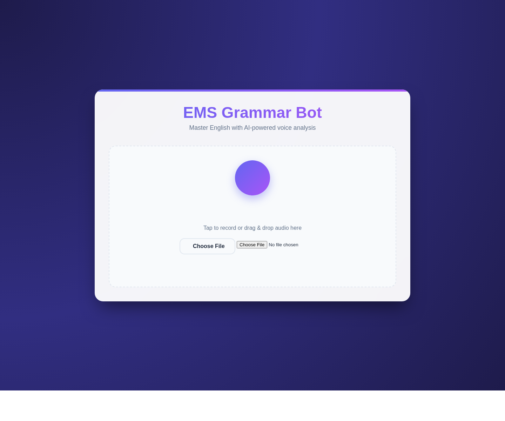
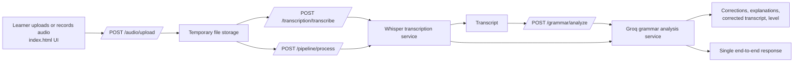

# Grammar Bot

Grammar Bot is a FastAPI application for spoken-English grammar coaching. It lets a learner record or upload audio, transcribes the speech with Whisper, and sends the transcript to Groq for grammar analysis, corrections, and proficiency feedback.

## Highlights

- Voice-first workflow with drag-and-drop upload and in-browser recording UI
- Whisper-based speech-to-text transcription
- Groq-powered grammar feedback with explanations and corrected transcript output
- Separate endpoints for upload, transcription, grammar analysis, and full pipeline processing
- Interactive API docs through Swagger UI at `/docs`

## Screenshot



## Processing Flow



## How It Works

1. The frontend served by `index.html` collects audio from a file upload or browser recording.
2. `/audio/upload` validates the file type and size, then stores it temporarily.
3. `/transcription/transcribe` sends the audio to Whisper and returns the transcript.
4. `/grammar/analyze` sends the transcript to Groq and returns structured grammar feedback.
5. `/pipeline/process` combines all of the above into one request for the full workflow.

## Tech Stack

- **Backend:** FastAPI, Uvicorn, Pydantic Settings
- **Speech-to-text:** OpenAI Whisper, Torch, Torchaudio
- **Grammar analysis:** Groq API
- **Frontend:** Static HTML/CSS/JavaScript served from the FastAPI app

## Project Structure

```text
.
├── app
│   ├── api/routes           # Upload, transcription, grammar, and pipeline endpoints
│   ├── core                 # Configuration and logging setup
│   ├── models               # Request/response schemas
│   ├── services             # Audio, transcription, and grammar services
│   └── main.py              # FastAPI application entry point
├── docs/assets              # README assets
├── index.html               # Browser UI served at /
├── requirements.txt         # Python dependencies
└── check_ffmpeg.py          # FFmpeg availability helper
```

## Prerequisites

Before running the project, make sure you have:

- Python 3.10+
- FFmpeg installed and available on your `PATH`
- A Groq API key

You can verify FFmpeg with:

```bash
python check_ffmpeg.py
```

## Installation

```bash
python -m venv .venv
source .venv/bin/activate
pip install -r requirements.txt
```

## Configuration

Create a `.env` file in the repository root.

```env
GROQ_API_KEY=your_groq_api_key
GROQ_MODEL=mixtral-8x7b-32768
WHISPER_MODEL=base
HOST=0.0.0.0
PORT=8000
DEBUG=false
MAX_FILE_SIZE_MB=50
ALLOWED_EXTENSIONS=wav,mp3,webm,m4a,ogg
UPLOAD_DIR=temp_uploads
PROCESSING_TIMEOUT=300
```

### Key Environment Variables

| Variable | Purpose | Default |
| --- | --- | --- |
| `GROQ_API_KEY` | Authenticates requests to Groq | Required |
| `GROQ_MODEL` | LLM used for grammar analysis | `mixtral-8x7b-32768` |
| `WHISPER_MODEL` | Whisper model name for transcription | `base` |
| `PORT` | FastAPI server port | `8000` |
| `MAX_FILE_SIZE_MB` | Maximum uploaded audio size | `50` |
| `ALLOWED_EXTENSIONS` | Accepted audio file extensions | `wav,mp3,webm,m4a,ogg` |
| `UPLOAD_DIR` | Temporary audio storage directory | `temp_uploads` |

## Running the App

```bash
uvicorn app.main:app --host 0.0.0.0 --port 8000 --reload
```

Then open:

- App UI: `http://localhost:8000/`
- Swagger docs: `http://localhost:8000/docs`
- Health check: `http://localhost:8000/health`

## API Endpoints

| Endpoint | Method | Purpose |
| --- | --- | --- |
| `/audio/upload` | `POST` | Validate and upload an audio file |
| `/transcription/transcribe` | `POST` | Convert an uploaded audio file to text |
| `/grammar/analyze` | `POST` | Analyze transcript grammar and return corrections |
| `/pipeline/process` | `POST` | Run upload, transcription, and grammar analysis in one call |
| `/health` | `GET` | Return runtime configuration summary |

## Typical End-to-End Usage

1. Upload an audio file.
2. Transcribe it with Whisper.
3. Review or edit the transcript if needed.
4. Run grammar analysis.
5. Read the explanations, corrected transcript, and estimated language level.

## Notes

- Uploaded audio is stored temporarily and cleaned up after full pipeline processing.
- Grammar analysis expects English speech and forces Whisper transcription to English.
- Swagger UI is the easiest way to inspect request and response models during development.
